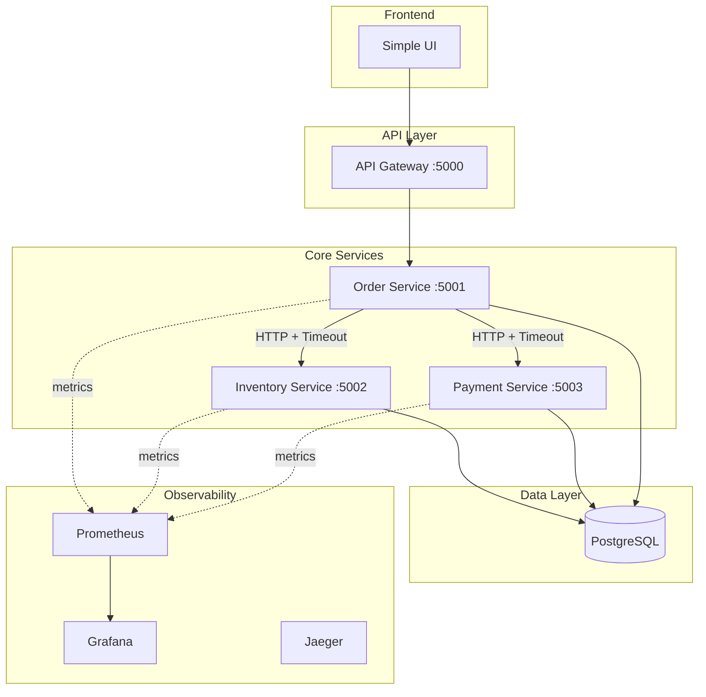

# Valerix Microservices Architecture Plan

## System Overview

A minimal 3-service e-commerce platform with fault tolerance, observability, and graceful degradation.



---

## Service Communication Pattern

### Synchronous HTTP (Keep It Simple for 2 Hours)

```
Order Flow:
1. POST /orders → Order Service
2. Order Service calls Inventory Service (with 2s timeout)
3. Order Service calls Payment Service (with 2s timeout)
4. Returns result or graceful error
```

### Timeout & Retry Strategy

| Service Call | Timeout | Retries | Fallback |
|-------------|---------|---------|----------|
| Order → Inventory | 2s | 1 | Mark order "PENDING_INVENTORY" |
| Order → Payment | 2s | 1 | Mark order "PENDING_PAYMENT" |

---

## Service Specifications

### Order Service (Port 5001)

| Endpoint | Method | Description |
|----------|--------|-------------|
| `/health` | GET | Health check + downstream deps |
| `/orders` | POST | Create new order |
| `/orders/:id` | GET | Get order status |

**Resilience Features:**
- HTTP client timeout: 2 seconds
- Graceful degradation: Returns "processing" status if downstream fails
- State tracking: Orders have statuses (PENDING, CONFIRMED, FAILED)

### Inventory Service (Port 5002)

| Endpoint | Method | Description |
|----------|--------|-------------|
| `/health` | GET | Health check + DB ping |
| `/inventory/:productId` | GET | Check stock |
| `/inventory/reserve` | POST | Reserve stock |
| `/inventory/release` | POST | Release reservation |
| `/gremlin/latency` | POST | Inject latency (testing) |

**Gremlin Latency Injection:**
```json
POST /gremlin/latency
{ "delay_ms": 3000, "enabled": true }
```

### Payment Service (Port 5003)

| Endpoint | Method | Description |
|----------|--------|-------------|
| `/health` | GET | Health check |
| `/payments` | POST | Process payment |
| `/payments/:id` | GET | Get payment status |

---

## Database Schema (Single PostgreSQL)

```sql
-- Orders table
CREATE TABLE orders (
    id UUID PRIMARY KEY DEFAULT gen_random_uuid(),
    user_id VARCHAR(255),
    product_id VARCHAR(255),
    quantity INT,
    status VARCHAR(50) DEFAULT 'PENDING',
    created_at TIMESTAMP DEFAULT NOW(),
    updated_at TIMESTAMP DEFAULT NOW()
);

-- Inventory table
CREATE TABLE inventory (
    product_id VARCHAR(255) PRIMARY KEY,
    stock INT DEFAULT 0,
    reserved INT DEFAULT 0
);

-- Payments table
CREATE TABLE payments (
    id UUID PRIMARY KEY DEFAULT gen_random_uuid(),
    order_id UUID REFERENCES orders(id),
    amount DECIMAL(10,2),
    status VARCHAR(50) DEFAULT 'PENDING',
    created_at TIMESTAMP DEFAULT NOW()
);
```

---

## Observability Stack

### Health Check Response Format

```json
{
  "status": "healthy|unhealthy",
  "service": "order-service",
  "dependencies": {
    "database": "connected",
    "inventory-service": "reachable",
    "payment-service": "reachable"
  },
  "timestamp": "2024-01-29T12:00:00Z"
}
```

### Prometheus Metrics

```
# RED Metrics per service
http_requests_total{service, method, path, status_code}
http_request_duration_seconds{service, method, path}
http_requests_in_flight{service}

# Custom alert metric
order_service_avg_latency_30s
```

### Grafana Alert Rule

```yaml
# Alert when avg response time > 1s over 30s window
- alert: OrderServiceSLABreach
  expr: avg(rate(http_request_duration_seconds_sum{service="order-service"}[30s])) 
        / avg(rate(http_request_duration_seconds_count{service="order-service"}[30s])) > 1
  for: 0m
  labels:
    severity: critical
```

---

## Docker Compose Structure

```yaml
services:
  order-service:
    ports: ["5001:5001"]
    depends_on: [postgres, inventory-service, payment-service]
    
  inventory-service:
    ports: ["5002:5002"]
    depends_on: [postgres]
    
  payment-service:
    ports: ["5003:5003"]
    depends_on: [postgres]
    
  postgres:
    image: postgres:15
    ports: ["5432:5432"]
    
  prometheus:
    ports: ["9090:9090"]
    
  grafana:
    ports: ["3030:3000"]
```

---

## Minimal Frontend (KISS)

Simple HTML + JavaScript dashboard showing:
- Service health status (green/red indicators)
- Create order form
- Order list with status
- SLA indicator (green < 1s, red > 1s)

---

## 2-Hour Implementation Timeline

| Time | Task |
|------|------|
| 0-20min | Docker Compose + DB setup |
| 20-50min | Inventory Service (health, stock endpoints, gremlin) |
| 50-80min | Payment Service (health, payment endpoint) |
| 80-110min | Order Service (orchestration, timeouts, graceful degradation) |
| 110-120min | Grafana dashboard + testing |

---

## Schrödinger's Warehouse Solution

Handle partial success with **idempotent operations** and **compensation**:

```go
// Order Service pseudo-code
func CreateOrder(order) {
    // 1. Create order in PENDING state
    order.Status = "PENDING"
    db.Save(order)
    
    // 2. Try inventory reservation (with timeout)
    err := inventoryClient.Reserve(order.ProductID, order.Quantity)
    if err == timeout {
        order.Status = "PENDING_INVENTORY_CHECK"
        // Background job reconciles later
        return order, "Processing - will confirm shortly"
    }
    
    // 3. Try payment (with timeout)
    err = paymentClient.Process(order.ID, order.Amount)
    if err == timeout {
        // Rollback inventory
        inventoryClient.Release(order.ProductID, order.Quantity)
        order.Status = "PENDING_PAYMENT"
        return order, "Payment processing..."
    }
    
    order.Status = "CONFIRMED"
    return order, nil
}
```

---

## Load Testing Script

```bash
#!/bin/bash
# Simple load test with curl
for i in {1..100}; do
  curl -X POST http://localhost:5001/orders \
    -H "Content-Type: application/json" \
    -d '{"product_id":"PROD-1","quantity":1}' &
done
wait
```
