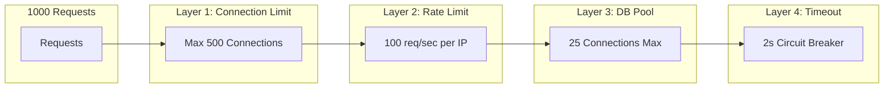

# Concurrency & Load Handling Architecture

This document explains how the Valerix microservices system handles high-concurrency scenarios.

---

## Case 1: 100 Users Ordering the Same Product Concurrently

### The Problem: Race Condition
When 100 users try to order the same product (e.g., only 50 units in stock), we risk **overselling**.

```
Stock = 50 units
100 users hit "Order" simultaneously
Without protection: All 100 might see "50 in stock" → 100 orders created → 50 orders can't be fulfilled
```

### Solution: Database-Level Pessimistic Locking

```sql
-- Use SELECT FOR UPDATE to lock the row during transaction
BEGIN;
SELECT stock, reserved FROM inventory 
WHERE product_id = 'PROD-001' 
FOR UPDATE;  -- Blocks other transactions until commit

-- Check if enough stock
IF stock - reserved >= requested_quantity THEN
    UPDATE inventory 
    SET reserved = reserved + requested_quantity
    WHERE product_id = 'PROD-001';
    COMMIT;
    -- Order proceeds
ELSE
    ROLLBACK;
    -- Return "Out of stock"
END IF;
```

### Request Flow Visualization

```
Timeline (milliseconds):
─────────────────────────────────────────────────────────────>

User 1:  [──LOCK──][──UPDATE──][COMMIT]
User 2:       [WAIT...........][──LOCK──][UPDATE][COMMIT]
User 3:            [WAIT................][──LOCK──][UPDATE][COMMIT]
...
User 51:                                               [LOCK][CHECK → OUT OF STOCK]
```

### Expected Behavior

| Metric | Value |
|--------|-------|
| Stock available | 50 units |
| Concurrent requests | 100 |
| Successful orders | 50 (first-come-first-served) |
| Rejected orders | 50 (graceful "out of stock" error) |
| Avg response time | 50-200ms per request |
| Max wait time | ~2-3 seconds for last user (queue effect) |

### Implementation in Go

```go
func (h *InventoryHandler) Reserve(ctx context.Context, productID string, quantity int) error {
    tx, _ := h.db.Begin(ctx)
    defer tx.Rollback(ctx)
    
    // Lock the row
    var stock, reserved int
    err := tx.QueryRow(ctx, `
        SELECT stock, reserved FROM inventory 
        WHERE product_id = $1 
        FOR UPDATE
    `, productID).Scan(&stock, &reserved)
    
    available := stock - reserved
    if available < quantity {
        return ErrInsufficientStock
    }
    
    // Reserve
    _, err = tx.Exec(ctx, `
        UPDATE inventory SET reserved = reserved + $1 
        WHERE product_id = $2
    `, quantity, productID)
    
    return tx.Commit(ctx)
}
```

---

## Case 2: 1000 Users Hitting Order API Simultaneously

### The Problem: Server Overload
1000 concurrent connections can overwhelm:
- Go HTTP server goroutines
- Database connection pool
- Downstream services (Inventory, Payment)

### Solution: Multi-Layer Protection



### Protection Layers

#### Layer 1: HTTP Server Connection Limits

```go
server := &http.Server{
    Addr:              ":5001",
    Handler:           router,
    MaxHeaderBytes:    1 << 20,        // 1MB
    ReadTimeout:       5 * time.Second,
    WriteTimeout:      10 * time.Second,
    IdleTimeout:       120 * time.Second,
    MaxConnsPerIP:     100,            // Limit per client
}
```

#### Layer 2: Rate Limiting Middleware

```go
// Allow 100 requests per second, burst of 50
rateLimiter := rate.NewLimiter(100, 50)

func RateLimitMiddleware(next http.Handler) http.Handler {
    return http.HandlerFunc(func(w http.ResponseWriter, r *http.Request) {
        if !rateLimiter.Allow() {
            http.Error(w, "Too Many Requests", http.StatusTooManyRequests)
            return
        }
        next.ServeHTTP(w, r)
    })
}
```

#### Layer 3: Database Connection Pool

```go
config, _ := pgxpool.ParseConfig(dbURL)
config.MaxConns = 25              // Max simultaneous queries
config.MinConns = 5               // Keep warm connections
config.MaxConnLifetime = 1 * time.Hour
config.MaxConnIdleTime = 30 * time.Minute
config.HealthCheckPeriod = 1 * time.Minute

pool, _ := pgxpool.NewWithConfig(ctx, config)
```

#### Layer 4: Downstream Timeout & Circuit Breaker

```go
// HTTP client with timeout
client := &http.Client{
    Timeout: 2 * time.Second,
    Transport: &http.Transport{
        MaxIdleConns:        100,
        MaxIdleConnsPerHost: 10,
        IdleConnTimeout:     90 * time.Second,
    },
}

// Simple circuit breaker
type CircuitBreaker struct {
    failures    int
    threshold   int       // Open circuit after 5 failures
    resetAfter  time.Duration
    lastFailure time.Time
    state       string    // "closed", "open", "half-open"
}
```

### Request Distribution

```
1000 Concurrent Requests
         │
         ▼
┌─────────────────────────────────┐
│  Layer 1: Accept 500 connections │  ← 500 get 503 Service Unavailable
│  (drop 500)                      │
└─────────────────────────────────┘
         │ 500 requests
         ▼
┌─────────────────────────────────┐
│  Layer 2: Rate limit 100/sec     │  ← 400 wait in queue
│  (process 100/sec)               │
└─────────────────────────────────┘
         │ 100 req/sec
         ▼
┌─────────────────────────────────┐
│  Layer 3: DB pool (25 conns)     │  ← 75 wait for connection
│  (25 concurrent queries)         │
└─────────────────────────────────┘
         │
         ▼
┌─────────────────────────────────┐
│  Layer 4: Process order          │  ← ~200ms per order
│  (Inventory + Payment calls)     │
└─────────────────────────────────┘
```

### Expected Behavior Under 1000 Concurrent Load

| Metric | Value |
|--------|-------|
| Immediate accepts | ~500 |
| Rejected (503) | ~500 |
| Processed per second | ~100 |
| Time to process 500 | ~5 seconds |
| Avg response time | 200-500ms |
| Timeout errors (if Gremlin enabled) | All after inventory call |

### Queue-Based Alternative (If More Time Available)

For production, add a message queue:

```
                                    ┌──────────────┐
1000 requests ──► Order API ──────► │ RabbitMQ     │ ──► Worker (processes 50/sec)
                  (accepts all,     │ Order Queue  │
                   returns 202)     └──────────────┘
```

```go
// Accept immediately, queue for processing
func (h *OrderHandler) CreateOrder(w http.ResponseWriter, r *http.Request) {
    order := parseOrder(r)
    order.Status = "QUEUED"
    
    // Save to DB
    h.db.Save(order)
    
    // Publish to queue (async)
    h.queue.Publish("orders", order)
    
    // Return immediately
    w.WriteHeader(http.StatusAccepted)
    json.NewEncoder(w).Encode(map[string]string{
        "order_id": order.ID,
        "status":   "QUEUED",
        "message":  "Order received, processing...",
    })
}
```

---

## Summary Comparison

| Scenario | Challenge | Solution | User Experience |
|----------|-----------|----------|-----------------|
| 100 users, same product | Race condition, overselling | `SELECT FOR UPDATE` (DB lock) | First 50 succeed, rest get "out of stock" |
| 1000 concurrent requests | Server overload | Rate limiting + connection pools + timeouts | ~500 processed, ~500 get 503, retries encouraged |

---

## Metrics to Monitor

```promql
# Requests rejected by rate limiter
sum(rate(http_requests_total{status_code="429"}[1m]))

# Database connection pool exhaustion
pg_pool_waiting_connections

# Order success rate
sum(rate(orders_created_total{status="CONFIRMED"}[1m])) / 
sum(rate(orders_created_total[1m]))

# Inventory lock wait time
histogram_quantile(0.99, sum(rate(inventory_lock_duration_seconds_bucket[5m])) by (le))
```
